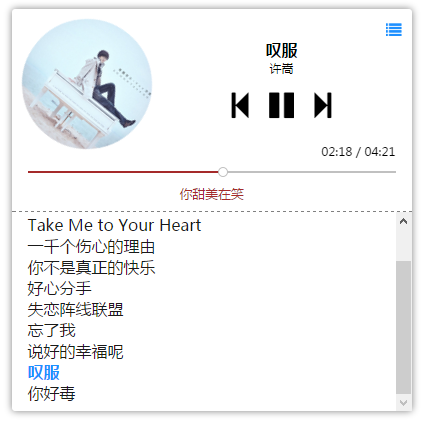

HTML5 Player
===


Usage
---
``` html
<script src="player-with-css.min.js"></script>
<div id="player"></div>
<script>
var player = new Player({
	container: document.getElementById('player'),
	// default images are used if no image of current song is assigned
	// (optional) path to default image (130*130 recommended)
	image: 'http://example.com/path/to/default/image',
	// (optional) path to default small image (34*34 recommended)
	smallimage: 'http://example.com/path/to/default/smallimage',
	// (optional) theme can be `simple` or `normal`, `normal` as default
	theme: 'normal',
	// (optional) classes refers to the class names of corresponding buttons
	// default values requires font-awesome: http://fontawesome.io
	classes: {
		list: 'fa fa-list',
		prev: 'fa fa-step-forward',
		play: 'fa fa-play',
		next: 'fa fa-step-forward',
		pause: 'fa fa-pause',
	},
});
player.setSongs([
	{
		name: 'Song1',
		url: 'http://example.com/path/to/song1.mp3',
		// (optional) name of artist
		artist: 'Gerald',
		// (optional) length of song in seconds
		duration: 1024,
		// (optional) path to image (130*130 recommended) of song
		image: 'http://example.com/path/to/image/of/song1.png',
		// (optional) path to small image (34*34 recommended) of song
		smallimage: 'http://example.com/path/to/smallimage/of/song1.png',
		// (optional) lyric
		lyric: '[00:00]lalala\n[00:03]foo\n[00:05]bar',
		// (optional) jsonp url for lyric if lyric is not provided
		// the real link will be 'http://example.com/path/to/lyric?jsonp=randomCallbackName'
		lyricjsonp: 'http://example.com/path/to/lyric',
	}, {
		name: 'Song2',
		url: 'http://example.com/path/to/song2.mp3',
	}
]);
// start playing songs[index] by `player.play(index)`
player.play(0);
</script>
```

Examples
---
<http://gerald.top/code/h5player>


