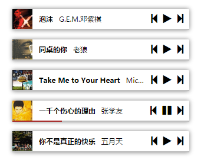

## H5Player


### Installation

``` sh
$ yarn add h5player
# or
$ npm install h5player -S
```

### Usage

1. Load `h5player`

  * Via global

    ``` html
    <link rel="stylesheet" href="https://unpkg.com/h5player/dist/style.css">
    <script src="https://unpkg.com/h5player/dist/index.js"></script>
    <script>
    const { H5Player } = window;
    </script>
    ```

  * Via CMD

    ``` javascript
    const H5Player = require('h5player');
    ```

  * Via ESModule

    ```js
    import H5Player from 'h5player';
    ```

2. Create a player and append it to `document.body` (or any mounted element).

   ``` javascript
   const player = new H5Player({
     image: 'http://example.com/path/to/default/image',
     getLyric: (song, callback) => {
       const lyric = getLyricFromSomewhereElse(song);
       callback(lyric);
     },
   });
   document.body.appendChild(player.el);

   player.setSongs([
     {
       name: 'Song1',
       url: 'http://example.com/path/to/song1.mp3',
       additionalInfo: 'whatever',
     }, {
       name: 'Song2',
       url: 'http://example.com/path/to/song2.mp3',
     }
   ]);
   player.play(0);
   ```

### Document

Each player is built with `player = new H5Player(options)`. *options* is an object with properties below:

* `theme`: *optional* string  

  Possible values are `normal` (by default) and `simple`.
  Can be changed by `player.setTheme(theme)`.

* `showPlaylist`: *optional* Boolean

  Whether to show playlist. Can be changed by `player.setPlaylist(show)`.

* `image`: *optional* string *or* object  

  Image shown when no image is assigned for the current song.  
  It can be a string of the path to the image or an object with theme names as the keys and
  image paths as the values.  
  The recommended image size for **normal** theme is 130 * 130, and 34 * 34 for **simple** theme.

* `getLyric`: *optional* function

  An async function to get the lyric. There are two parameters for the callback. The first parameter is the song object and the second is a callback to send the lyric to the player.

The `player` object has following methods:

* `setSongs`(*Array* songs)  

  Set playlist for the player, *songs* is a list of `object`s with properties below:

  * `name`: *required* string  

    The name of the song.

  * `url`: *required* string  

    A downloadable URL.

  * `artist`: *optional* string  

    The name of the artist.

  * `duration`: *optional* integer  

    Length of the song in seconds.

  * `image`: *optional* string *or* object  

    The image for the current song. Similar to the default image in common settings.

  * `lyric`: *optional* string  

    Lyric of the song, e.g. `[00:00]foo\n[00:05]bar\n...`.

* `play`(*int* index)  

  Start playing the *index*-th song.

* `setTheme`(*string* theme)

  Change theme.

* `setPlaylist`(*boolean* show)

  Toggle playlist on / off.

When the play status is changed, a `PlayerEvent` will be fired with its `detail` set to an object with following attributes:

* `player`  

  The `Player` object that is related to this event

* `type`  

  `'play'` or `'pause'`

The player is mounted to `player.el`, you need to append it to the container.

### Snapshots

Normal theme:


Simple theme: (multiple players)


